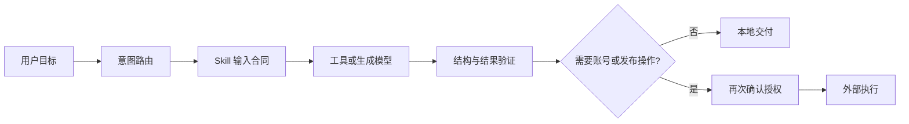

# AIGC377 Agent Skill Portfolio

面向 AI Agent 开发岗位的 Skill / Workflow 作品索引。这里展示的是我实际参与制作、适配或集成的项目，并明确区分原创、公开脱敏重写、MIT 适配与上游 Fork。

## 项目索引

| 仓库 | 类型 | 展示能力 |
| --- | --- | --- |
| [AIGC377-momoco-content-director-skill](https://github.com/sunset377/AIGC377-momoco-content-director-skill) | 原创公开脱敏重写 | Agent 路由、Prompt Contract、结构化工作流、数据校验、安全停止线 |
| [AIGC377-fitness-training-journal-skill](https://github.com/sunset377/AIGC377-fitness-training-journal-skill) | 原创 Skill | 中文视觉规则、人物一致性、事实保护、图像生成降级策略 |
| [AIGC377-mono-color-editorial-skill](https://github.com/sunset377/AIGC377-mono-color-editorial-skill) | MIT 上游适配 | 设计系统 JSON、跨运行环境适配、原创性防火墙、稳定配方 |
| [AIGC377-social-auto-upload](https://github.com/sunset377/AIGC377-social-auto-upload) | 上游 Fork / 工具集成 | 小红书等平台的命令式发布、登录状态检查、多账号隔离与失败回退 |

## 与 Agent 开发岗位的对应关系

- Prompt Engineering：把自然语言需求编译成可执行的结构化合同，并设置负向约束与降级策略。
- Function / Tool Calling：通过明确的输入、输出和停止条件调用本地脚本或 CLI。
- Workflow：把输入检查、执行、验证、人工审批和外部发布拆成可追踪阶段。
- RAG / 项目知识：按任务读取最小必要的规则与参考资料，不把历史说明当作实时事实。
- Vibe Coding：用 AI 协作完成 Skill、脚本、测试、前端作品集与部署验证。
- 内容生产：覆盖中文文案、视觉设计、短视频导演提示词和自媒体运营工作流。

## 作品关系

## 公开范围

本索引不包含客户素材、账号 Cookie、登录凭据、个人照片、内部经营数据或无许可的第三方源码。MOMOCO 案例仓库是从零重写的公开脱敏版本，不是内部生产仓库的镜像。

